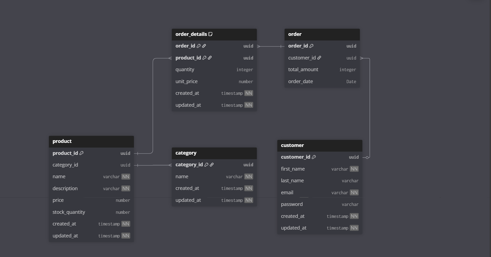
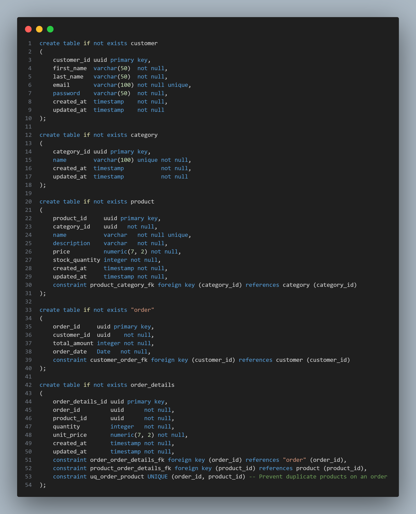
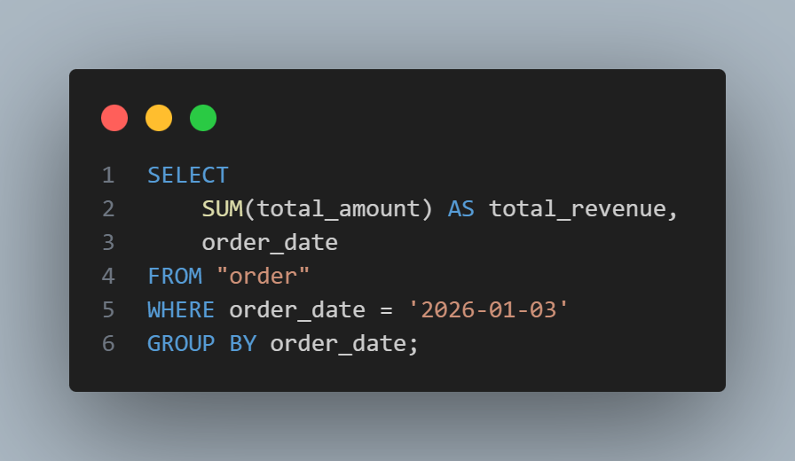
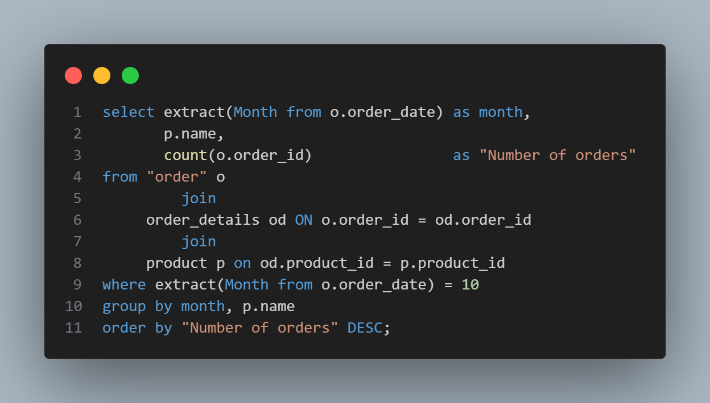
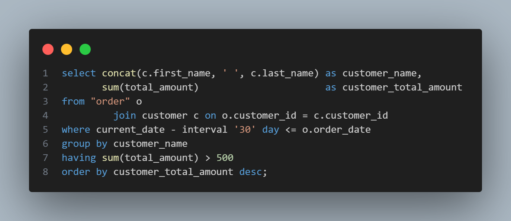
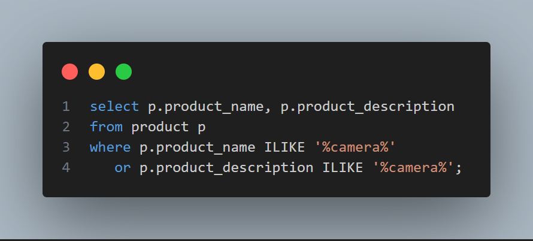

# E-commerce Database Documentation

This document outlines the conceptual and logical design for the e-commerce database, focusing on products, customers, orders, and sales history.

## 1. Entity-Relationship Diagram (ERD)

## 2. Database Schema

The following scripts create the necessary tables in a PostgreSQL vendor.

## 3. Database Queries

1 - Write an SQL query to generate a daily report of the total revenue for 
a specific date.  

2 - Write an SQL query to generate a monthly report of the top-selling 
products in a given month. 

3 - Write a SQL query to retrieve a list of customers who have placed 
orders totalling more than $500 in the past month. Include customer 
names and their total order amounts.

4 - Write a SQL query to search for all products with the word "camera" 
in either the product name or description.

